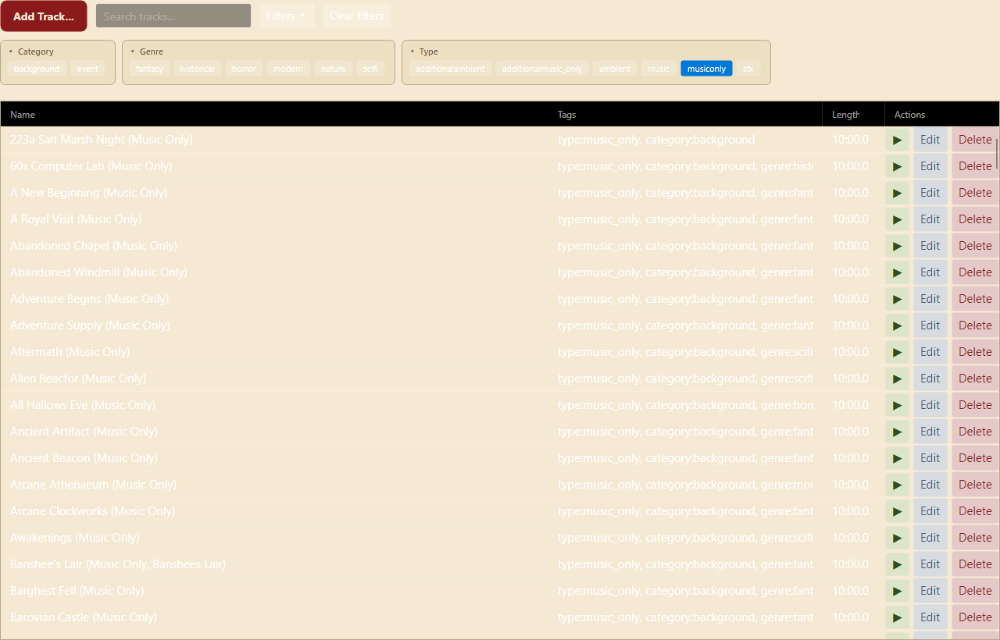
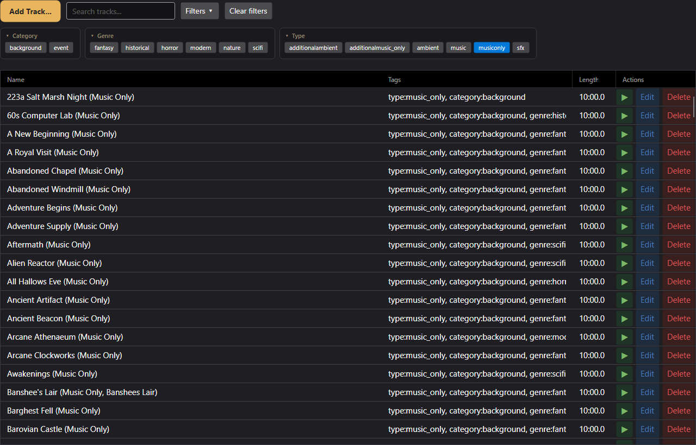

# gmsb-theme-high-fantasy

High Fantasy theme pack for [Game Master Sound Board](https://github.com/DevinSanders/game-master-soundboard).

Two selectable palettes for fantasy RPG sessions. Each appears as its own entry in the host's theme dropdown.

| Palette        | Vibe                                                       | Primary accent              | Secondary accent              |
|----------------|------------------------------------------------------------|------------------------------|--------------------------------|
| Tavern Hearth  | Reading an ancient map by candlelight — parchment & ink.   | Vintage ruby red #8B1A1A     | Deep forest green #2D5016     |
| Deep Dungeon   | Navigating a stone crypt with a single torch — iron & ember. | Torchlight amber #E8B45C    | Magical sapphire blue #4A7FB8 |

**Tavern Hearth** — Aged parchment cream surfaces with walnut-ink text, vintage ruby as the ink-stamp accent (for primary actions and warnings), forest green for success states. Perfect for downtime / tavern / library scenes.

**Deep Dungeon** — Cast-iron charcoal and slate surfaces, warm bone-cream text, glowing torchlight amber for primary actions, sapphire blue for info. Perfect for expedition / crypt / combat scenes.

## Previews

| Tavern Hearth | Deep Dungeon |
|---|---|
| [](screenshots/TavernHearth.png) | [](screenshots/DeepDungeon.png) |

Click either screenshot for the full-resolution image.

## Install

**Paid plugin.** The source is open here for reference, but the pre-built
binary is distributed pay-what-you-want on itch.io:

**→ https://dsand64.itch.io/gmsb-theme-high-fantasy**

Download the `.zip` from that page and drop it onto **Settings → Plugin
Manager** in Game Master Sound Board. Themes activate live — no restart needed; pick the palette under **Settings → Appearance → Theme**.

## Build

```powershell
dotnet build src/HighFantasyThemePlugin.csproj
pwsh scripts/package.ps1
# → dist/github.DevinSanders-theme.high-fantasy-1.0.0.zip
```

Requires .NET 10 SDK. `SoundBoard.PluginApi` is restored from NuGet automatically — no sibling checkout needed.

## Plugin manifest

| Field     | Value                              |
|-----------|------------------------------------|
| publisher | `github.DevinSanders`              |
| id        | `theme.high-fantasy`               |
| entryDll  | `HighFantasyThemePlugin.dll`       |
| isTheme   | `true`                             |

## License

Released under the [MIT License](LICENSE). Original colour design for this pack.
